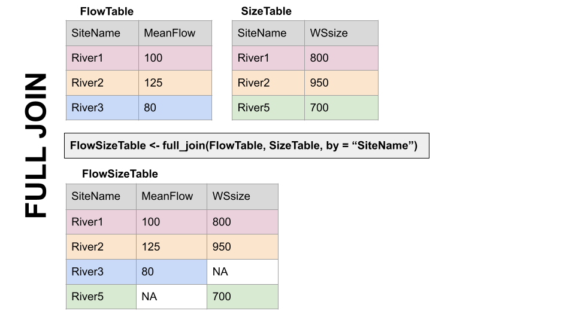
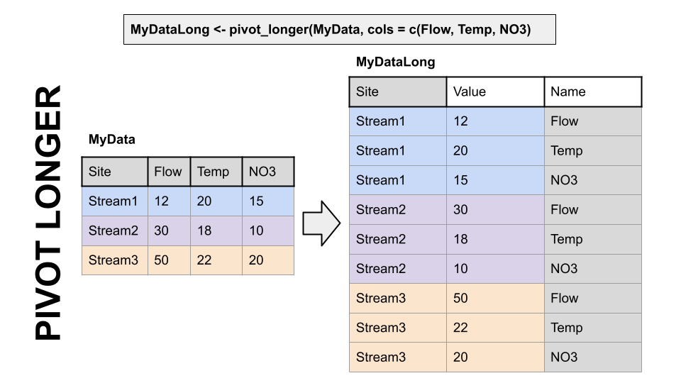
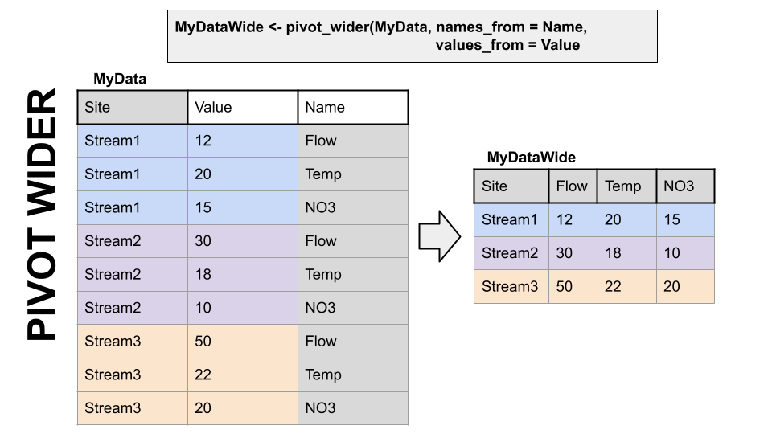

# Joins, Pivots, and USGS dataRetrieval {#getdata}

Use Template Repository from github: 

Readings: Introduction to the dataRetrieval package <https://cran.r-project.org/web/packages/dataRetrieval/vignettes/dataRetrieval.html>

Chapter 12 & 13 of R for Data Science <https://r4ds.had.co.nz/tidy-data.html>

## Goals for today

* Get familiar with the dataRetrieval package
* Intro to joins
* Learn about long vs. wide data and how to change between them

Prep question: How would you get data from the USGS (non-R)?

Install the dataRetrieval package. Load it and the tidyverse.

```{r, message = FALSE}
#install.packages("dataRetrieval")
library(dataRetrieval)
library(tidyverse)
library(lubridate)
```

## Exploring what dataRetrieval can do.

Think about the dataRetrieval as a way to interact with same public data you can access through waterdata.usgs.gov but without having to click on buttons and search around. It makes getting data or doing analyses with USGS data much more reproducible and fast!

To explore a few of the capabilities (NOT ALL!!) we will start with the USGS gage on the New River at Radford. The gage number is 03171000.

The documentation for the package is extremely helpful: <https://cran.r-project.org/web/packages/dataRetrieval/vignettes/dataRetrieval.html>

I always have to look up how to do things because the package is very specialized! This is the case with most website APIs, in my experience. It's a good argument for getting good at navigating package documentation! Basically you just look through and try to piece together the recipe for what you want to do using the examples they give in the document.

First, let's get information about the site using the readNWISsite() and whatNWISdata() functions. Try each out and see what they tell you.

Remember, all the parameter codes and site names get passed to dataRetrieval functions as characters, ao they must be in quotes.

```{r}
#important: note the site number gets input as a character


#Information about the site


#What data is available for the site?
#Daily values, mean values

```
## Joins

When we look at what whatNWISdata returns, we see it gives us parameter codes, but doesn't tell us what they mean. This is a common attribute of databases: you use a common identifier but then have the full information in a lookup file. In this case, the look-up information telling us what the parameter codes mean is in "parameterCdFile" which loads with the dataRetrieval package.

So, you could look at that and see what the parameters mean.

OR We could have R do it and add a column that tells us what the parameters mean. Enter JOINS!

Joins allow us to combine the data from two different data sets that have a column in common. At its most basic, a join looks for a matching row with the same key in both datasets (for example, a USGS gage number) and then combines the rows. So now you have all the data from both sets, matched on the key.

But you have to make some decisions: what if a key value exists in one set but not the other? Do you just drop that observation? Do you add an NA? Let's look at the different options.

Take for example the two data sets, FlowTable and SizeTable. The SiteName values are the key values and the MeanFlow and WSsize values are the data.

{width="400"} 

Note River1 and River2 match up, but River3 and River5 only exist in one data set or the other.

The first way to deal with this is an **INNER JOIN: inner_join()** In an inner join, you only keep records that match. So the rows for River3 and River5 will be dropped because there is no corresponding data in the other set. See below:


But what if you don't want to lose the values in one or the other or both?!

For instance, let's say you have a bunch of discharge data for a stream, and then chemistry grab samples. You want to join the chemistry to the discharge based on the dates and times they were taken. But when you do this, you don't want to delete all the discharge data where there is no chemistry! We need another option. Enter OUTER JOINS

**LEFT JOIN, left_join():** Preserves all values from the LEFT data set, and pastes on the matching ones from the right. This creates NAs where there is a value on the left but not the right. (this is what you'd want to do in the discharge - chemistry example above)


**RIGHT JOIN, right_join():** Preserves all values from the RIGHT data set, and pastes on the matching ones from the left. This creates NAs where there is a value on the right but not the left.


**FULL JOIN, full_join():** KEEP EVERYTHING! The hoarder of the joins. No matching record on the left? create an NA on the right! No matching value on the right? Create an NA on the left! NAs for everyone!



When you do this in R, you use the functions identified in the descriptions with the following syntax (see example below):

**if the column is named the same in both data sets**
> xxx_join(left_tibble, right_tibble, by = "key_column")**

**if the column is named differently in both data sets**
> xxx_join(left_tibble, right_tibble, by = c("left_key" = "right_key")


Note in both of the above, when you specify which column to use as "by" you have to put it in quotes.

## Join example

So in the chunk below let's get add information about the parameters in dataAvailable by joining it with the key file: parameterCdFile. The column with the parameter codes is called parm_cd in dataAvailable and parameter_cd in parameterCdFile

```{r}

```

## Finding IDs to download USGS data

You can find sites via map and just enter the id like we did in the chunks above: <https://maps.waterdata.usgs.gov/mapper/index.html>

Below we will look at two other ways to get sites: using a bounding box of a geographic region, or search terms like State and drainage area

```{r}
#find sites in a bounding box
#coords of bottom left, top right


#get sites in this bounding box that have daily water temperature and discharge


#find sites with other criteria, VA, less than 20 sqmi, other criteria can be used..
#check out the CRAN documentation


```

## OK let's download some data!

We are going to use readNWISdv(), which downloads daily values.

We will tell it which sites to download, which parameters to download, and then what time period to download.

siteNumber gets the sites we want to download, USGS site numbers, as a character. We will use the swva_sites data we generated (yep, you can download multiple sites at once!)

startDate and endDate get the.... start and end dates. IMPORTANT: These must be in YYY-MM-DD format, but you don't have to tell R they are dates before you give them to the function, it'll do that for you.

parameterCd get the parameters you want to download. We want water temperature and discharge, which are "00060" and "00010", respectively.

Once we have the data, the column names correspond to the keys that identify them, for example, discharge will be 00060 something something. Fortunately the dataRetrieval package also provides "renameNWISColumns()" which translates these into words, making them more easily understood by humans. We can pipe the results of our download to that function after we get the data to make the column names easier to understand.

```{r}

```

Let's plot the water temperature data as a line and control the color of the lines with the different sites.

What could be better about this plot?

```{r}

```

We can add site names with....More joins! Our swva_sites data has the names of the sites in human-friendly language. The column in the downloaded data and in the swva_sites data is called "site_no" so we just give that to the "by" argument. Perform a left join to add the names of the sites to the data.

Then use select to remove some of the unnecessary columns.

Then make the plot and then snazz it up with labels and a non-junky theme.

```{r}

```

## Pivoting: wide and long data

Okay, so with the data above: what would you do if you wanted to subtract the discharge or temperature of one gage from another on the same river: to compute rate of change between the two sites, for instance.

You could split them into two objects, then join based on date?

Or...now hear me out... you could PIVOT them.

A two-dimensional object can be either long or wide. Each has it's advantages.

**LONG**

Each observation has it's own row. In the first image below, the table on the left is long because each measure of "cases" has it's own row. It's year and country are identified by a second column, and the values in that column repeat a lot. (Look at country and year in the table on the left)

**WIDE**

Observations of different things have their own columns. In the second image below, notice in the right hand table there is a "cases" and "population" column rather than an identifier in a separate column like in the table on the left.

**Why?**

Long and wide data are more efficient for different things. Think about plotting a data set with 10 stream gages. If they are in a long format, you can just add color = Gage to your ggplot aes(). If they are in a wide format, meaning each gage has it's own column, you'd have to write a new geom for EACH gage, because they're all in separate columns.

Now imagine you want to do some math to create new data: let's say cases divided by population in the second image below.... How would you even do that using the data on the left? With the wide data on the right it is simply mutate(casesPERpop = cases / population).

Finally, which table is easier to read in TABLE format (not a plot) in each of the two images below? Wide data is much more fitting for tables.





dplyr, part of the tidyverse, has functions to convert data between wide and long data. I have to look up the syntax every single time I use them. But they are VERY useful.

## Pivot Examples

Back to our original question: I want to subtract the flow at Ivanhoe from the flow at Radford on the new river to see how much flow increases between the two sites through time.

To do this I am going to use pivot_wider() to give Ivanhoe and Radford discharges their own column.

First, we will use select to trim the data to just what we need, then call pivot_wider telling it which data to use for the new column names (names_from = station_nm) and what values we want to pivot into the data under those columns (values_from = Flow).

Then, subtract the two and make a plot!

```{r}

```

To further illustrate how to move between long and wide data and when to use them, let's grab some water quality data. This process will also review some of the other concepts from this topic.

In the chunk below we will look to see what sites have data for nitrate and chloride in our swva bounding box from above. We will them filter them to just stream sites (leave out groundwater and springs). And finally we will download the nitrate and chloride data for those sites.

```{r}
#Nitrate as nitrate and chloride


#what sites in our bounding box have cloride and nitrate


#filter to just stream water

```

Now, let's clean things up a bit.

Join the parameter names from parameterCdFile and then join the site names from swva_chem_site. Then select just the columns we want, and finally filter the remaining data to just look at sites from the New River.

To illustrate the functionality of the data in this format, plot Chloride for each site, and then plot Chloride AND Nitrate, using the parameter name in facet_wrap.

```{r}

```

Now let's say we want to calculate something with chloride and nitrate. We need to make the data wide so we have a nitrate column and a chloride column. Do that below. What goes into values_from? what goes into names_from?

Next, plot Chloride + Nitrate. Could you do this with the data in the previous format?

Finally, use pivot_longer to transform the data back into a long format. Often you'll get data in a wide format and need to convert it to long, and we haven't tried that yet. The only argument you'll need to pass to pivot_longer() in this case is to tell it what columns to turn into the new DATA column (using the cols = ) parameter.

```{r}

```
